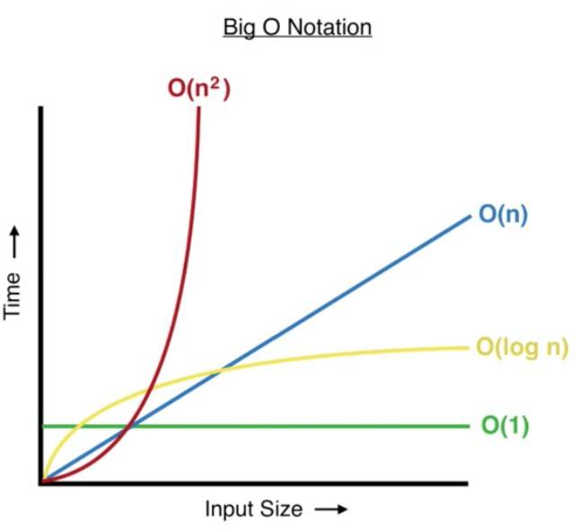

# Time Complexity

Time complexity is the amount of time it takes to execute as a function of the input of size `n`. It describes the growth rate of an algorithm's execution time relative to the increase in input size.

## Efficiency Basis

```javascript
function oddNumberLessThan10() {
  let currNum = 1;
  while (currNum < 10) {
    if (currNum % 2 !== 0) {
      console.log(currNum);
    }
    currNum += 1;
  }
}
```

If we were to run this in the terminal, we will get numbers `1`, `2`, `3`, `7` and `9` printed to the console. it probably took a fraction of a second to run. if we were to run it again, it might take the same time, or might be faster or slower depending on what else computer is doing. if we were to run it on a different computer, it would again run faster or slower. therefore, its important to understand that we never measure the efficiency by how long it takes to execute.

The way to measure code efficiency is to evaluate how many steps it takes to complete. if you know that one algorithm you write takes 5 steps and another one takes 20 steps to accomplish same task, then we can say that the 5-step algorithm will run always run faster than the 20-step algorithm on the same computer.

How many steps does `oddNumbersLessThan10 function` take to execute

1. We assign number 1 to a variable. That is 1 step.
2. We have a loop. For each iteration of loop, we do the following:
   1. Compare `currNum` to see if it is less than 10. That is 1 step.
   2. We then check if `currNum` is odd, that is 1 step
   3. If it is then we output it to the terminal. That's 1 step every 2 iterations.
   4. We increase `currNum` by 1. That is 1 step.
3. To exit the loop, we need to compare `currNum` one last time to see that is is not less than ten any more. That is one last step

So there are 3 steps for every loop iteration and it iterates 9 times which is 27 steps. Then we have one step which iterates for only half the loop iteration which is 5 steps. Assigning an initial value to `currNum` and checking the exit condition of the loop is one each step. 27 + 5 + 1 + 1 = 34 steps.

Therefore,we can say our algorithm takes 34 steps to complete.

While this is useful to know, it isn't actually helpful for comparing algorithms. To see why, let's slightly modify our initial algorithm to take in a number instead of setting a hard default of 10..

```javascript
function oddNumbers(maxNumber) {
  let currNum = 1;

  while (currNum < maxNumber) {
    if (currNum % 2 !== 0) {
      console.log(currNum);
    }

    currNum += 1;
  }
}
```

The number of steps above code takes depends on the `maxNumber`, if we set it to 10, like we did before, the number of steps is 34, but if we enter another number, the number of steps changes. There is no concrete number we can use to measure the efficiency of our code, because it changes based on an external input.

To able to measure number of steps of our algorithm, we use the concept Asymptotic Notations and, in particular, Big O.

## Asymptotic Notations

Asymptotic Notations are used to describe the running time of an algorithm. Because an algorithm's running time can differ depending on the input, there are several notations that measure that running time in different ways. The 3 most common are as follows:

- Big O Notation - represents the upper bound of an algorithm. This means the worst-case scenario for how the algorithm will perform.
- Omega Notation - represents the lower bound of an algorithm. This is the best-case scenario.
- Theta Notation - represents both the upper bound and lower bound and therefore analyses the average case complexity of an algorithm.

Big O is the one that is most commonly referenced because we need to be sure the worst-case scenario for any code is scalable as inputs grow in application.

The Notations given below for Big O also apply to Omega and Theta Notations. The differences are in how they look to measure the efficiency of the algorithm and therefore which Notation should apply.

## What is Big O?

Big o gives us a consistent way to measure the efficiency of an algorithm. It gives us a measurement for the time it takes for an algorithm to run as the input grows so that you can directly compare the performance of two algorithms and pick the best one.

### Big O Notation

The Big O notations in the order of speed from fastest to slowest are:

- `O(1)`: Constant Complexity
- `O(logn)`: Logarithmic Complexity
- `O(n)`: Linear Complexity
- `O(nlogn)`: n \* logn Complexity
- `O(n^2)`: Quadratic Complexity
- `O(n^3)`: Cubic Complexity
- `O(2^n)`: Exponential Complexity
- `O(n!)`: Factorial Complexity

### O(1) - Constant Complexity

```javascript
arr = [1, 2, 3, 4, 5];
```

If we want to loop up what is at index 2, we can get to element using `arr[2]`, which would give us `3`. This takes one step. If we double our array.

```javascript
arr = [1, 2, 3, 4, 5, 6, 7, 8, 9, 10];
```

We can still access any element in just one step. `arr[7]` gives us `8` in single step. Our array can keep growing, and we can always access any element in single step. It's constant. Hence we have `O(1)`.

Computer must first look where the array is in memory, then it needs to jump to index provided, so that's atleast couple of steps. However, the other steps are merely incidental numbers, and Big O does not concern itself with these numbers.

### O(logn) - Logarithmic Complexity

Logarithmic Complexity tells us that the number of steps an algorithm takes increases by 1 as the data doubles. That's pretty efficient.

One such algorithm is Binary Search. It only works on sorted array.

```javascript
arr = [1, 2, 3, 4, 5, 6, 7, 8, 9, 10];
```

To find out if array contains the number `7`, binary search calculates the middle index using formula:

```javascript
let middleIndex = Math.floor((startIndex + endIndex) / 2);
```

Using this formula, we can eliminate `5` and everthing to its left, as those those numbers are less than `7`.

```javascript
arr = [-, -, -, -, -, 6, 7, 8, 9, 10];
```

The middle index now will be `7`, so we eliminate `8` and everythng to its right.

```javascript
arr = [-, -, -, -, -, 6, 7, -, -, -];
```

We repeat this process until we have array of just one items and check if the number is what we're looking for.

Below table summarizes the size of an array doubling and how many steps in Big O terms we would need to arrive at the one element to see if it matches what we're looking for:

| Size | Steps |
| ---- | ----- |
| 1    | 1     |
| 2    | 2     |
| 4    | 3     |
| 8    | 4     |
| 16   | 5     |
| 32   | 6     |

### O(n) - Linear Complexity

Linear Complexity tells us that as the number of items grow, number of steps grows at the exact same rate. Every time we iterate over an array is an example of linear complexity.

### O(n logn) - n \* logn Complexity

It implies that we have an algorithm which initially is `O(logn)`, but the algorithm is processed by another algorithm with complexity of `O(n)`. One such algorithm is merge sort. But there are some cases like constructing a cartesian tree, where the algorithm naturally behaves like `O(nlogn)` without using the smaller parts.

### O(n^2) - Quadratic Complexity

It's commonly seen when we loop over a data set, and within each loop, we loop over again. For example, if our array has 3 items, the nested loops require 3^2 = 9 sub-steps.

### O(n^3) - Cubic Complexity

It's commonly seen in triple loops. If our array has 3 items, the triple nested loops required 3^3 = 27 sub-steps.

### O(2^n) - Exponential Complexity

Exponential Complexity means that each item added to the data size, the number of steps doubles from the previous number of steps.

| Size | Steps |
| ---- | ----- |
| 1    | 2     |
| 2    | 4     |
| 3    | 8     |
| 4    | 16    |
| 5    | 32    |
| 6    | 64    |
| 7    | 128   |
| 8    | 256   |
| 9    | 512   |
| 10   | 1024  |

### O(n!) - Factorial Complexity

The Factorial Complexity is seen when we need to calculate permutations or combinations. If we have an array, and we have to work on all the combinations we can make from the array, that is factorial complexity.

## Alternatives to Big O

### Big Ω (Omega notation)

Omega Notation gives us the best-case scenario for an algorithm.

```javascript
function findValue(arr) {
  for (let i = 0; i < arr.length; i++) {
    let item = arr[i];
    if (item === 1) {
      return item;
    }
  }
}
```

In the worst case, which occurs when the item is not in array, or is last item, the algorithm has linear complexity `O(n)`.

However, in the best-case the value we are looking for will be first item in array. This has a complexity of `O(1)`. This is its Omega Complexity.

### Big-Θ (Big-Theta notation)

While Omeag Notation measures the best-case scenario for an algorithm's efficieny, and Big O measures the worst case, theta looks to give the exact value between narrow upper and lower bounds.

If we had some code that looped every item in an array, then the size of array will not matter. Our algorithm wil always run in `O(n)` in best-case and worst-case scenarios. In that case, the exact performance is `O(n)`, and that is Theta performance of our algorithm. For other algorithms, theta may represent both the lower and upper bound of an algorithm that has different complexities.

## Why Big O

Using a worst-case scenario we can make sure our algorithm will scale in all outcomes.

## Algorithms with same complexity

```javascript
function oddNumbers(maxNum) {
  let currNum = 1;

  while (currNum < maxNum) {
    if (currNum % 2 !== 0) {
      console.log(currNum);
    }

    currNum += 1;
  }
}
```

The time complexity of this algorithm is `O(n)`.

```javascript
function oddNumbers(maxNum) {
  let currNum = 1;

  while (currNum < maxNum) {
    if (currNum % 2 !== 0) {
      console.log(currNum);
    }

    currNum += 2;
  }
}
```

This time we increase the `currNum` by 2, This is an algorithm of `O(n/2)`, but big O doesn't concern itself with constants because they aren't relative to how an algorithm scales as the input changes. Therefore, the Big O efficiency of both algorithms in `O(n)`.

## What is Big O Notation and why is it useful?

Big O Notation is used in computer science to analyse the performance of an algorithm(an algorithm is just another name for a function - a set of instructions). Big O specifically looks at the worst-case scenario of an algorithm.

## The graph of Big O Notation



In `O(1)`, as we increase the input size, the time taken to compute does not increase, it remains constant.

## Example 1 - Constant Time Complexity: Big O(1)

```javascript
function timesTwo(num) {
  return 2 * num;
}
let result = timesTwo(5); // 10
let result2 = timesTwo(2000); // 4000
```

It takes a number as an argument, and returns 2 times that number. So, if we pass in 5, it will return 2 times 5, which is 10. If we pass in 2000, it wil return 4000.

In Javascript, both take same time. It's just one operation. 20 _ 2 billion takes as long as 2 _ 3. No matter what number we input into this function, it takes the same amount of time to compute. The algorithm is said to have Big O(1) - pronounced "Big O of 1" - which is constant time complexity.

In below function, we multiply it by 4, save it to a variable called `total` and return `total` times 3. Now, we wouldn't say say this function hasd a Big O of 2, it'd still jus be a Big O of 1.

```javascript
function manyTimes(num) {
  let total = 4 * num;
  return total * 3;
}
```

## What is Time Complexity and Space Complexity

### Time Complexity

Analysing how the runtime of an algorithm changes as the input increases. The algorithms we went through above had constant Big O Time Complexity because the runtime of the algorithms did not increased as the input size increased.

### Space Complexity (aka Auxilary Space Complexity)

The space required by an algorithm, not including inputs. The algorithms above had constant space complexity. The function `timesTwo` did not store any values in memory. `manyTimes` only stored one value in memory, `total`. Both the algorithms have a constant space complexity because if we increase the size of the input, the space in memory remains the same.

There is usually a trade-off between space complexity and time complexity, to increase the speed of an algorithm, we will likely need to store more variables in memory.

## Example 2 - Linear Time Complexity: Big (n)

```javascript
function reverseArray(arr) {
  let newArr = [];
  for (let i = arr.length - 1; i >= 0; i--) {
    newArr.push(arr[i]);
  }
  return newArr;
}
const reversedArray1 = reverseArray([1, 2, 3]); // [3, 2, 1]
const reversedArray2 = reverseArray([1, 2, 3, 4, 5, 6]); // [6, 5, 4, 3, 2, 1]
```

In this algorithm, we are looping over each element in the array, as if we increase the length of the array, the operations will also increase

## Example 3 - Quadratic Time Complexity

```javascript
function multiplyAll(arr1, arr2) {
  if (arr1.length !== arr2.length) return undefined;
  let total = 0;
  for (let i of arr1) {
    for (let j of arr2) {
      total += i * j;
    }
  }
  return total;
}
let result1 = multiplyAll([1, 2], [5, 6]); // 33
let result2 = multiplyAll([1, 2, 3, 4], [5, 3, 1, 8]); // 170
```

The total number of operations will be `arr1.length`, which is n, times `arr2.length`, which is also n. This results in `Big O(n^2)`

## Using Big O to compare algorithms

We pull in data from an API, an array of 1000 users comes back, and we need to sort this into alplabetical order. If we use a sorting algorithm with linear time, `O(n)`, then there will be around 1000 operations. But, if we use a sorting algorithm with `O(n^2)` time complexity, then the operations will be 1000 * 1000, which is 1 million operations. 

Thats 999,000 more operations, just becuase we used a bad algorithm at en inappropriate time. 

## What about built-in-methods?